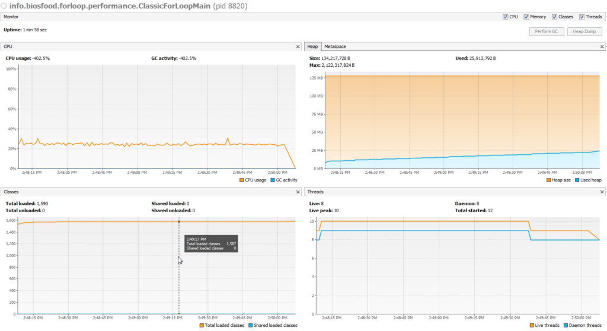
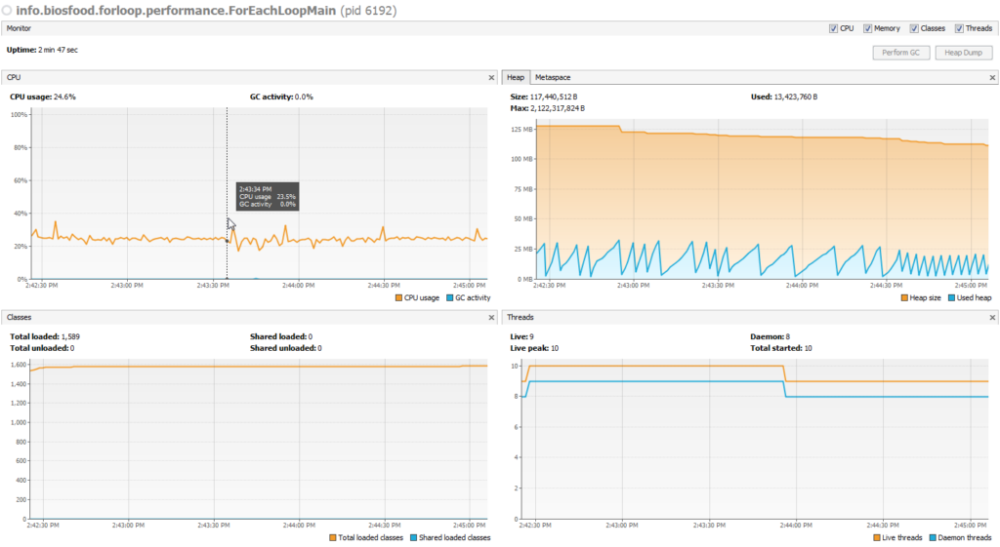
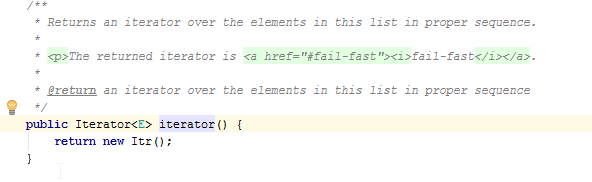

# Performance and memory usage of loop for
## Introduction
Since Java 5 we have very convenient tool to iterate elements such as `for-each` ([Oracle documentation is here](http://docs.oracle.com/javase/1.5.0/docs/guide/language/foreach.html)). 
It's used widely in applications, we nearly forgot about classic `for` loop as it's less convenient - needs 
to introduce a variable counter to iterate elements in an array and requires a bit more coding. But is performance 
and memory usage the same for both loops? I have created two examples of elements iteration. After runs of the examples 
I got different time execution and monitoring result have big differences.

## Two examples of for loop implementation, but with different performance
As an example I created two 5,000 elements in an `ArrayList` and three nested `for` iterate the elements in the list. 
It means that finally the list was iterated 5,000<sup>3</sup> with retrieving values from a `list` instance with no type conversion.

### Classic for loop
First example is a classic `for` loop. Three nested for loops iterate the same list. The value is retrieved by index, 
no type conversion. I run the code below and you can see output in console and a VisualVM screenshot with monitoring parameters.

```java
public class ClassicForLoopMain {

    public static void main(String... args) {
        new ClassicForLoopMain().test();
    }
    
    public void test() {
        List<Integer> subject = CreateListBuilder.create()
        .withElementsCount(5000).build();
        
        TimeMeasurement tm = TimeMeasurement.create();
        
        for(int i = 0; i < subject.size(); i++) {
            Integer value1 = subject.get(i);
            for(int i2 = 0; i2 < subject.size(); i2++) {
                Integer value2 = subject.get(i2);
                for(int i3 = 0; i3 < subject.size(); i3++) {
                    Integer value3 = subject.get(i3);
                }
            }
        }
    
        tm.stopwatch();
    }

}

```

The was doing the iteration without 118 seconds, not bad for so many iterations.

```text
----- TimeMeasurement -----
created at: Thu Feb 09 14:48:05 CET 2017
----- Stopwatch -----
created at:                         Thu Feb 09 14:50:03 CET 2017
time since start, seconds:          117.797
time since last stopwatch, seconds: 117.797
```

If take a look monitoring parameters, particularly at memory usage, you can see that nothing interesting was going on: 
memory was growing slowly during program execution. Lets move on and take a look a second example and his results.




### For each loop
In this example I wrote a test which iterates a list with three nested `for` loops, but I use here `for-each` loop in each 
of three loops to iterate the same instance of `List` class. As in the example I only retrieve element, no type conversion.

```java
public class ForEachLoopMain {

    public static void main(String... args) {
        new ForEachLoopMain().test();
    }
    
    public void test() {
        List<Integer> subject = CreateListBuilder.create()
        .withElementsCount(5000).build();
        
        TimeMeasurement tm = TimeMeasurement.create();
        
        for(Integer i : subject) {
            for(Integer i2 : subject) {
                for(Integer i3 : subject) {
                
                }
            }
        }
        
        tm.stopwatch();
    }

}
```

Here is results of invocation of the application. It spend more time to iterate the same amount of elements.

```text
----- TimeMeasurement -----
created at: Thu Feb 09 14:42:19 CET 2017
----- Stopwatch -----
created at:                         Thu Feb 09 14:45:07 CET 2017
time since start, seconds:          167.774
time since last stopwatch, seconds: 167.774
```

If you take a look at memory usage, you can notice that the memory is used more actively - allocated and cleared very often. 
The same iteration but with different result.



### Why is there so big difference?
The difference is in how the code is compiled. If you take a look at a decompiled `ClassicForLoopMain` class you can notice 
that nothing has been changed crucially.

##### ClassicForLoopMain.class decompiled
```java
public class ClassicForLoopMain {
    public ClassicForLoopMain() {
    }
    
    public static void main(String... args) {
        (new ClassicForLoopMain()).test();
    }
    
    public void test() {
        List subject = CreateListBuilder.create().withElementsCount(5000).build();
        TimeMeasurement tm = TimeMeasurement.create();
        
        for(int i = 0; i < subject.size(); ++i) {
        Integer value1 = (Integer)subject.get(i);
            for(int i2 = 0; i2 < subject.size(); ++i2) {
            Integer value2 = (Integer)subject.get(i2);        
                for(int i3 = 0; i3 < subject.size(); ++i3) {
                    Integer var8 = (Integer)subject.get(i3);
                }
            }
        }
        
        tm.stopwatch();
    }
}
```

But when we decompiled code of the `ForEachLoopMain` class you can notice that the source code was transformed significantly. 
`Iterator` is used widely here. Ok, but why is memory used actively here in compare with previous example.

##### ForEachLoopMain.class decompiled
```java
public class ForEachLoopMain {
    public ForEachLoopMain() {
    }
    
    public static void main(String... args) {
        (new ForEachLoopMain()).test();
    }
    
    public void test() {
        List subject = CreateListBuilder.create().withElementsCount(5000).build();
        TimeMeasurement tm = TimeMeasurement.create();
        Iterator var3 = subject.iterator();
        
        while(var3.hasNext()) {
            Integer i = (Integer)var3.next();
            Iterator var5 = subject.iterator();
            
            while(var5.hasNext()) {
                Integer i2 = (Integer)var5.next();                
                Integer var8;
                for(Iterator var7 = subject.iterator(); var7.hasNext(); var8 = (Integer)var7.next()) {
                    ;
                }
            }
        }
        
        tm.stopwatch();
    }
}
```

The answer is hidden in a method `iterator()` of `ArrayList`. Every time we call `iterator()` a new instance of `Iterator` is created.
In this particular case about *5000<sup>2</sup> + 1* instances were created. I believe it's prodigally just to iterate elements. 
May be if exclude creation of instances `Iterator` the performance of the loop could be the same, but I would notice 
that in usage of "ancient" `for` loop is better than "new" `for-each` loop.



### Conclusion
In this article I covered an important part of `for` loop performance and memory usage. I believe that everything new 
is well forgotten old and usage of `for` loop with counter is preferable in applications where low latency is one 
of all more important requirements.  Also, I'd like to highlight that `for` loop uses less memory which is also 
important in devices with limited RAM. Of course usage of new Java features is important as Java developers implemented 
them for our convenience, but everything we use we should understand how it works to avoid problems.
